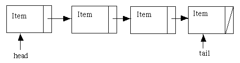
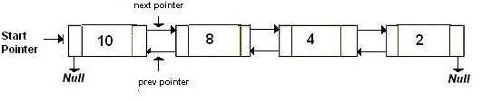
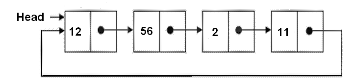
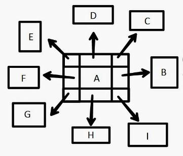

### Graph

Linked List atau senarai berantai adalah suatu metode menyimpan data dengan record memiliki setiap alamat dari record selanjutnya (atau disebutnya urutan). Elemen data yang dihubungkan dengan link disebut Node.

Linked List terdapat istilah, yaitu:

1. Head, elemen yang berada pada posisi pertama
2. Tail, elemen yang berada pada posisi terakhir

Jenis-jenis Linked List, adalah:

1. Single
   Single Linked List merupakan metode yang hanya memiliki satu variabel pointer saja. Di mana pointer tersebut menunjuk satu node selanjutnya.
   

2. Double
   Double Linked List merupakan metode yang memiliki dua variabel pointer yaitu, menunjuk pointer selanjutnya dan pointer sebelumnya.
   

3. Circular
   Circular Linked List merupakan metode yang Tail (atau Node Terakhir) menunjuk ke Head (Node Pertama).
   

4. Multiple
   Multiple Linked List merupakan metode yang lebih dari dua variabel pointer.
   
